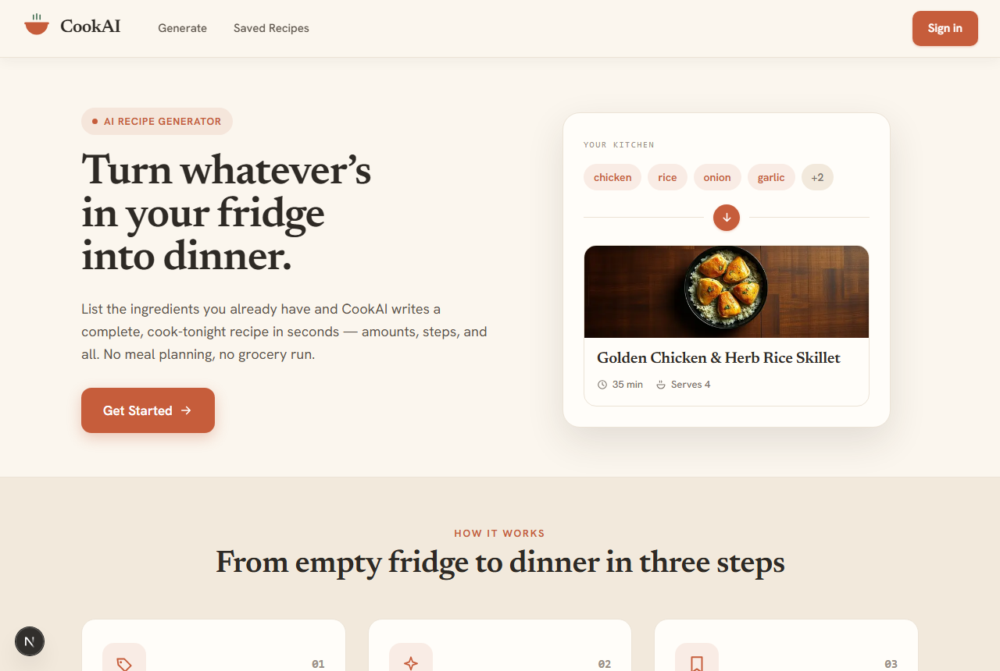
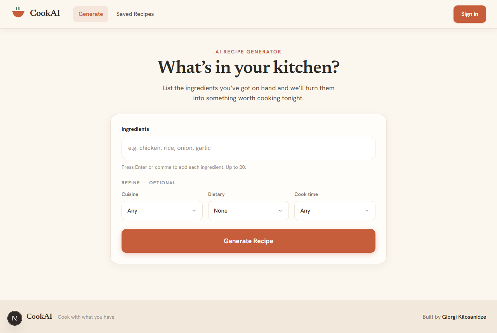
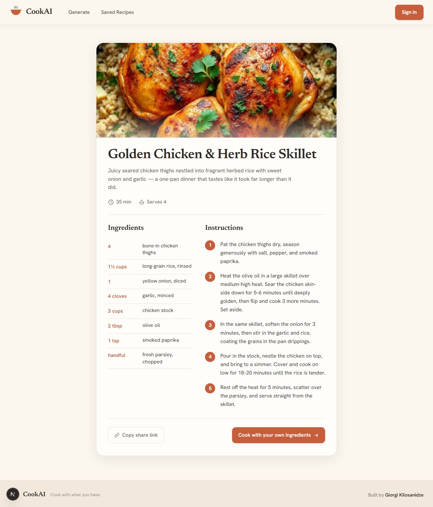

# 🍳 CookAI — turn what's in your kitchen into recipes worth cooking

Tell CookAI the ingredients you have on hand and it writes a complete recipe in seconds — exact amounts, numbered steps, and an AI-generated photo of the dish. Save the ones you love to your personal cookbook and share them with a link.

**[Live demo →](https://cook-ai-sooty.vercel.app)** &nbsp;·&nbsp; try it without signing up, or use the demo account below to see the cookbook.

> **Demo account** — `demo@cookai.app` / `demo1234` (comes with a few saved recipes to browse)



## What it does

- **Generate** — type your ingredients as quick tags, optionally refine by cuisine, dietary needs, and cook time, and get a full recipe from Gemini. Infeasible combinations (say, "ice cubes and salt") are politely refused rather than hallucinated into a "recipe".
- **Dish photos** — every recipe gets a food photo generated by FLUX.1 on Cloudflare Workers AI before the card is revealed.
- **Tweak it** — adjust the result in place ("make it spicier", "no oven") or ask for a different dish from the same ingredients.
- **Save & share** — signed-in users can save recipes to their cookbook; every saved recipe has a public share link (`/recipe/…`) with proper Open Graph previews and schema.org `Recipe` structured data.
- **Auth** — email + password or Google sign-in.

| Generate                            | Shared recipe page                    |
| ----------------------------------- | ------------------------------------- |
|  |  |

## Tech stack

- **Next.js 16** (App Router, Turbopack) · **React 19** · **TypeScript** · **Tailwind CSS 4**
- **Auth.js (NextAuth v5)** with JWT sessions, credentials + Google providers
- **Prisma 7** on **Neon** serverless Postgres (`@prisma/adapter-neon`)
- **Google Gemini** (`@google/genai`) for recipe generation, **Cloudflare Workers AI** (FLUX.1-schnell) for dish photos
- Deployed on **Vercel**

### Implementation notes

- The generate endpoint has two modes — fresh generation and tweak — behind one route, with server-side input caps mirrored client-side for UX.
- API routes are rate-limited per client (generation, image, signup) so the public demo can't be scripted into burning AI quota.
- SEO: per-page metadata with canonical URLs, OG/Twitter cards, `robots.txt` + `sitemap.xml` via the Metadata API, `WebApplication` and `Recipe` JSON-LD.
- Saved thumbnails are downscaled client-side before upload (~50 KB data URIs), not the full ~1 MB generated photo.

## Running locally

```bash
npm install
npm run dev
```

Create `.env.local` with:

| Variable                                         | Purpose                                                                                                        |
| ------------------------------------------------ | -------------------------------------------------------------------------------------------------------------- |
| `DATABASE_URL`                                   | Neon Postgres connection string (pooled)                                                                       |
| `AUTH_SECRET`                                    | Auth.js session secret (`npx auth secret`)                                                                     |
| `GEMINI_API_KEY`                                 | Google AI Studio key for recipe generation                                                                     |
| `CLOUDFLARE_ACCOUNT_ID` / `CLOUDFLARE_API_TOKEN` | Workers AI credentials for dish photos                                                                         |
| `AUTH_GOOGLE_ID` / `AUTH_GOOGLE_SECRET`          | _(optional)_ Google OAuth — the button hides itself when unset                                                 |
| `NEXT_PUBLIC_SITE_URL`                           | _(optional)_ canonical origin for SEO metadata; on Vercel it falls back to the production domain automatically |

Then apply the schema with `npx prisma migrate dev` and open http://localhost:3000.

---

Built by [Giorgi Kilosanidze](https://github.com/giorgikilosanidze).
